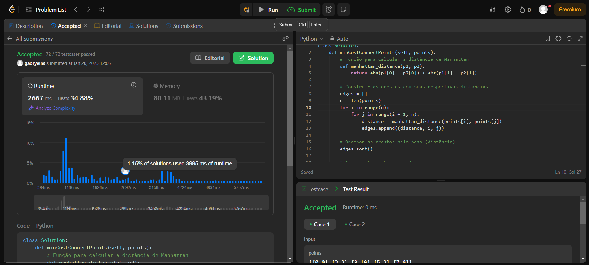
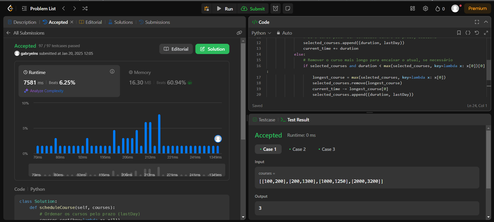
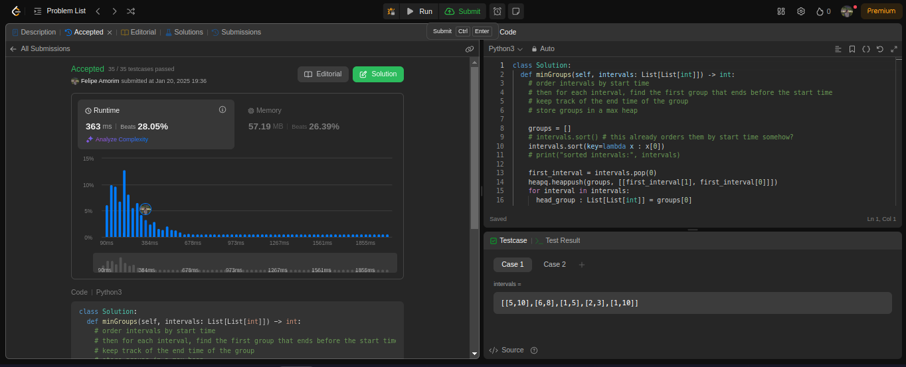
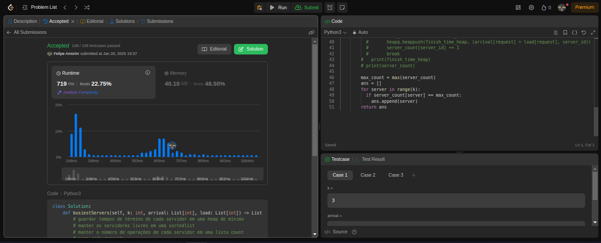

# Greddy LeetCode

**Número da Lista**: 62 
**Conteúdo da Disciplina**: Algoritmos Ambiciosos 

## Alunos
|Matrícula | Aluno |
| -- | -- |
| 221022275  |  Felipe Amorim de Araújo |
| 221022570  |  Gabryel Nícolas Soares de Sousa  |

## Sobre 
O projeto envolve a resolução de alguns problemas desafiadores do juiz online LeetCode envolvendo os conceitos estudados no conteúdo de Algoritmos Ambiciosos da disciplina de Projeto de Algoritmos. Os problemas resolvidos, links e resoluções podem ser encontrados na tabela a seguir:

| Nome do Problema | Link | Dificuldade | Resolução |
| -- | -- | -- | -- |
| 2406. Divide Intervals Into Minimum Number of Groups | [LeetCode](https://leetcode.com/problems/divide-intervals-into-minimum-number-of-groups/description/) | Média | [Resolução](./2406_Divide_Intervals_Into_Minimum_Groups/Solution.py) |
| 1584. Min Cost to Connect All Points | [LeetCode](https://leetcode.com/problems/min-cost-to-connect-all-points/description/) | Média | [Resolução](./1584_Min_Cost_to_Connect_All_Points/Solution.py) |
| 630. Course Schedule III | [LeetCode](https://leetcode.com/problems/course-schedule-iii/description/) | Difícil | [Resolução](./630_Course_Schedule_III/Solution.py) |
| 1606. Find Servers That Handled Most Number of Requests | [LeetCode](https://leetcode.com/problems/find-servers-that-handled-most-number-of-requests/description/) | Difícil | [Resolução](./1606_Find_Servers_That_Handled_Most_Number_Of_Requests/Solution.py) |

## Screenshots
- Min Cost to Connect All Points 

- Course Schedule III

- Divide Intervals Into Minimum Number of Groups

- Find Servers That Handled Most Number of Requests

## Instalação 
**Linguagem**: Python 

## Uso 
Para executar as resoluções, copie o código em cada arquivo e coloque no LeetCode, ou crie casos de testes para execução de cada arquivo

## Vídeo

https://www.youtube.com/watch?v=qaPnJyNT28U

